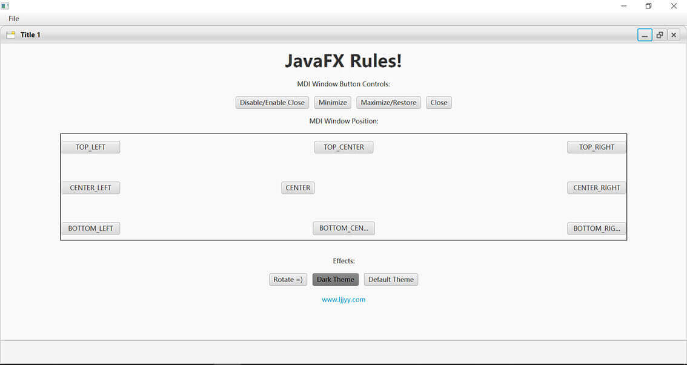

# javaFXMDI

在 Windows 窗体应用程序中，经常会在一个窗体中打开另一个窗体， 通过窗体上的不同菜单选择不同的操作，这种在一个窗体中打开另一个窗体的方式可以通过设置 MDI 窗体的方式实现。

MDI (Multiple Document Interface) 窗体被称为多文档窗体，它是很多 Windows 应用程序中常用的界面设计。

而遗憾的是，虽然很多编程语言都提供了显著的MDI属性，但Java却算是个例外，基本上只能通过JDesktopPane结合JInternalFrame进行实现。

[javaFX MDI](https://github.com/myhhub/javaFXMDI)是Swing JDesktopPane的JavaFX版本，可以用作类似于JInternalFrames的单个“子”的容器。您可以最小化子框架，它的图标位于容器窗格的底部，类似于Windows任务栏。



创建javaFx MDI 窗体代码：

```
public class Main extends Application {
    int count = 0;
    public static HostServices hostServices;

    @Override
    public void start(Stage primaryStage) throws Exception {
        hostServices = getHostServices();

        //Creat main Pane Layout
        AnchorPane mainPane = new AnchorPane();
        mainPane.setPrefSize(800, 600);
        //Creat MDI Canvas Container
        MDICanvas mdiCanvas = new MDICanvas(MDICanvas.Theme.DEFAULT);
        //Fit it to the main Pane
        AnchorPane.setBottomAnchor(mdiCanvas, 0d);
        AnchorPane.setLeftAnchor(mdiCanvas, 0d);
        AnchorPane.setTopAnchor(mdiCanvas, 25d);//Menu place
        AnchorPane.setRightAnchor(mdiCanvas, 0d);
        //Put the container Into the main pane
        mainPane.getChildren().add(mdiCanvas);

        //Create a 'New MDI Window' Button
        MenuBar menuBar = new MenuBar();
        menuBar.prefWidthProperty().bind(primaryStage.widthProperty());
        // File menu - new, save, exit
        Menu fileMenu = new Menu("File");
        MenuItem newMenuItem = new MenuItem("New");
        MenuItem exitMenuItem = new MenuItem("Exit");
        fileMenu.getItems().addAll(newMenuItem, new SeparatorMenuItem(), exitMenuItem);
        newMenuItem.setOnAction(actionEvent -> {
            Node content = null;
            try {
                content = FXMLLoader.load(getClass().getResource("/MyContent.fxml"));
            } catch (Exception e) {
            }
            count++;
            //Create a Default MDI Withou Icon
            MDIWindow mdiWindow = new MDIWindow("UniqueID" + count,
                    new ImageView("/assets/WindowIcon.png"),
                    "Title " + count,
                    content);
            //Set MDI Size
            //Add it to the container
            mdiWindow.maximizeRestoreMdiWindow();
            mdiCanvas.addMDIWindow(mdiWindow);
        });
        exitMenuItem.setOnAction(actionEvent -> Platform.exit());

        menuBar.getMenus().addAll(fileMenu);
        mainPane.getChildren().add(menuBar);

        primaryStage.setScene(new Scene(mainPane));
        primaryStage.setMaximized(true);
        primaryStage.show();

    }
```